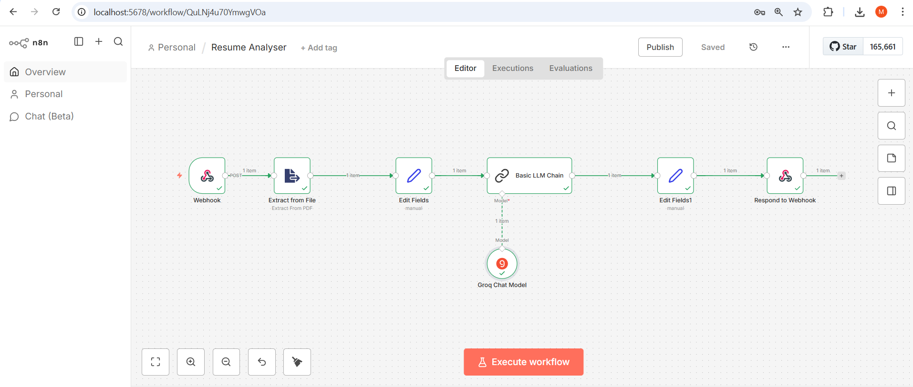
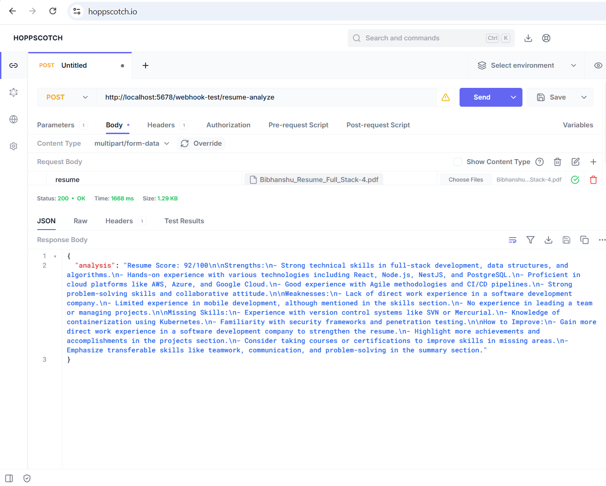

# Resume Analyzer using n8n

This project analyzes resumes (PDF) and gives:
- Resume score
- Strengths
- Weaknesses
- Missing skills
- Improvement suggestions

## Tech Stack
- n8n (workflow automation)
- Groq LLM (Llama 3.1)
- PDF Resume Input
- Hoppscotch for testing

## How it Works
1. User uploads resume (PDF)
2. Text is extracted from PDF
3. Resume text is sent to Groq LLM
4. AI analyzes and returns feedback

## How to Use
1. Import the workflow JSON into n8n
2. Add your Groq API key
3. Run the webhook
4. Upload a resume PDF

## Output Example
- Resume Score: 85/100
- Clear strengths and weaknesses
- Simple improvement tips

## Author
Mohammad Wasim Akhter

## Workflow

# Resume Analyzer using n8n

## Workflow

## Output Example

## Files
- Resume Analyser.json → n8n workflow
- workflow.png → workflow screenshot
- Output.png → sample output

## Output Example

